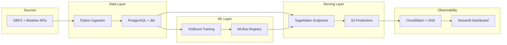

# Brief Overview

## What Problem This Solves

Paris bikeshare stations can fail in two ways that matter operationally: a station runs out of bikes, or it runs out of docks. This project predicts both risks 30 minutes ahead for 1,400+ stations so an operations team can rebalance inventory before stockouts happen.

The platform is built as an end-to-end production-style MLOps system rather than a notebook-only model demo:
- live GBFS and weather ingestion
- dbt-based warehouse and feature pipelines
- dual-target model training and packaging
- AWS SageMaker staging and production endpoints
- quality, drift, latency, and freshness monitoring
- a Streamlit dashboard for live operations and model health

## System Architecture

More detail: [docs/architecture.md](docs/architecture.md)

## 3-Minute Demo

- Portfolio walkthrough: [Dashboard of Biskeshare Stockout Prediction.mp4](Dashboard%20of%20Biskeshare%20Stockout%20Prediction.mp4)
- Expanded demo page: [DEMO.md](DEMO.md)

## Dashboard Highlights

### Live Operations Map

### Prediction Quality

### System Health

## Key Engineering Decisions

1. Built separate bikes and docks serving paths instead of a single blended target.
This keeps model packages, SageMaker endpoints, deployment state, thresholds, metrics, and rollback isolated per business target.

2. Used dbt-first transformation with explicit offline and online feature surfaces.
The warehouse keeps an offline 5-minute feature table for training and a latest-per-station online surface for serving, which makes lineage and feature parity easier to explain and debug.

3. Split orchestration into workload lanes.
Airflow queues and workers were separated into `core_5m`, `weather_10m`, `serving_rt`, `obs_main`, `obs_psi`, and `daily_sidecar` so unrelated tasks would not block the hot path.

4. Treated monitoring as part of the product, not as an afterthought.
The project publishes target-aware PR-AUC, F1, heartbeat, PSI, latency, and freshness signals into CloudWatch and surfaces them again in the Streamlit dashboard.

## One Real Production Issue I Solved

After changing DAG schedules, the platform started showing false freshness warnings even when ingestion, feature build, and prediction DAGs were all running on time.

I traced this to two separate issues:
- Airflow cross-DAG sensors were still resolving upstream logical dates with brittle schedule offsets
- the dashboard freshness policies were more aggressive than the real pipeline cadence and treated healthy in-flight runs as stale

The fix was to:
- refactor sensor date resolution to use the upstream cron schedule directly
- align freshness policies to the actual `gbfs -> hotpath -> feature -> prediction -> quality` runtime windows
- add regression tests around feature, prediction, and quality in-flight behavior so the dashboard would stop mislabeling healthy runs as warning

That work made the system more believable as a real production platform because the observability layer finally matched the runtime behavior.

## Why This Is Portfolio-Ready

- It solves a concrete operations problem, not just a modeling exercise.
- It includes real deployment, monitoring, rollback, and incident-style hardening work.
- It demonstrates data engineering, ML engineering, cloud deployment, orchestration, and operator UX in one coherent system.

If you want the full technical version, start from [README.md](README.md), [docs/architecture.md](docs/architecture.md), and [docs/operations_runbook.md](docs/operations_runbook.md).
