# Bikeshare Station Risk Monitor — MLOps Platform

Real-time 30-minute stockout prediction for 1,400+ Paris Velib bikeshare stations, powered by an end-to-end MLOps pipeline from data ingestion through model serving, monitoring, and automated retraining.

---

## Architecture

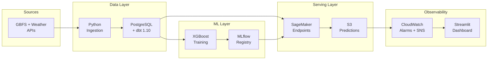

> Full system, data pipeline, ML lifecycle, and infrastructure Mermaid diagrams: [docs/architecture.md](docs/architecture.md)

---

## Live Dashboard

The Streamlit dashboard provides real-time visibility into station risk, model quality, and system health across five tabs.

### Live Ops Map

Station markers colored by stockout probability. Red = critical risk, orange = alert, teal = normal.

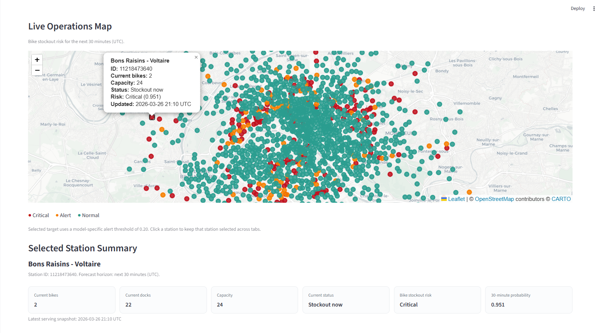
### Top-Risk Stations

Operator ranking table for the selected target (`bikes` or `docks`). Stations are ordered by 30-minute stockout probability, then by lower current target inventory, then by higher capacity; stations with `capacity <= 0` are excluded from the final table.


### Prediction Quality

Rolling PR-AUC, F1, precision, and recall from the 30-minute quality backfill loop.

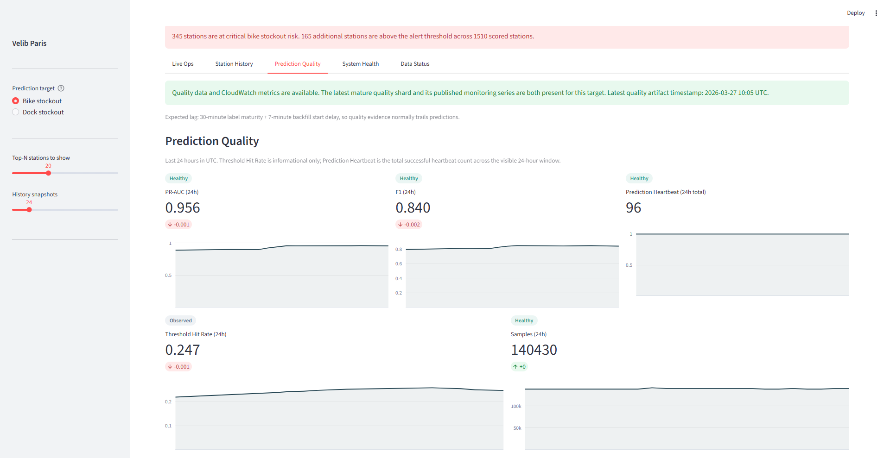
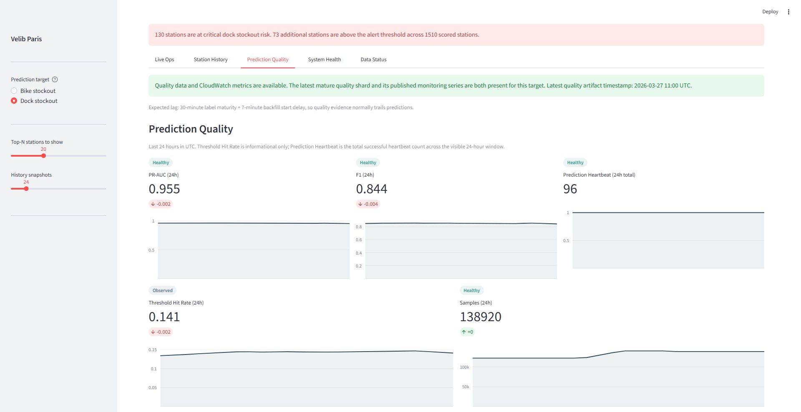

### System Health

SageMaker endpoint latency, invocation counts, error rates, and PSI drift metrics from CloudWatch.

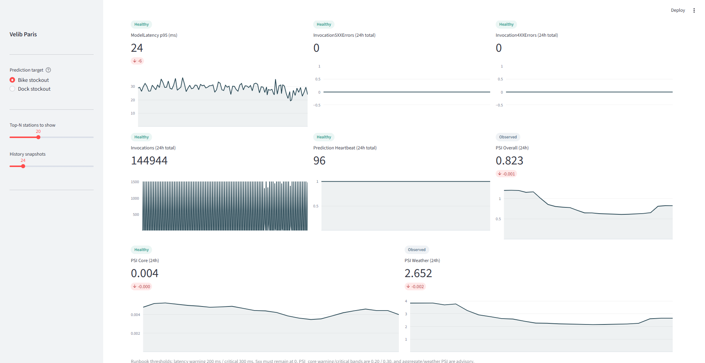
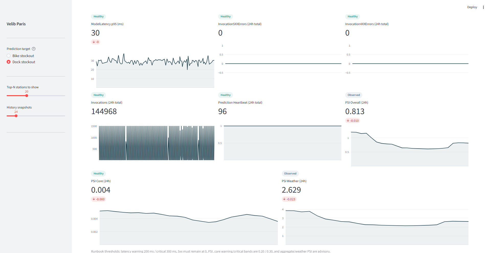
### Station History

Click any station to see its prediction score time series with the model-specific alert threshold.

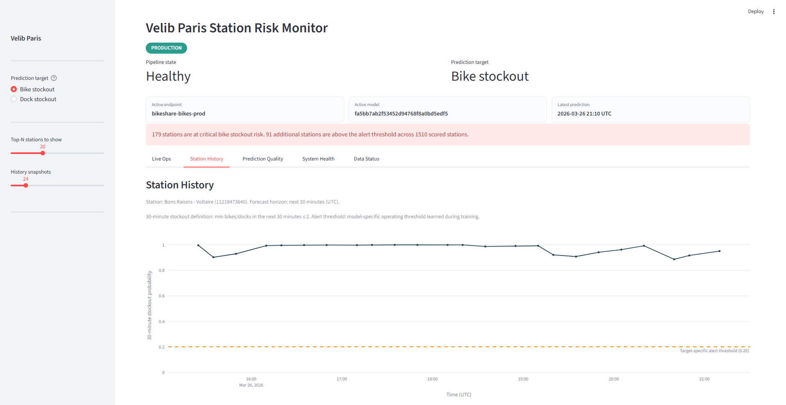
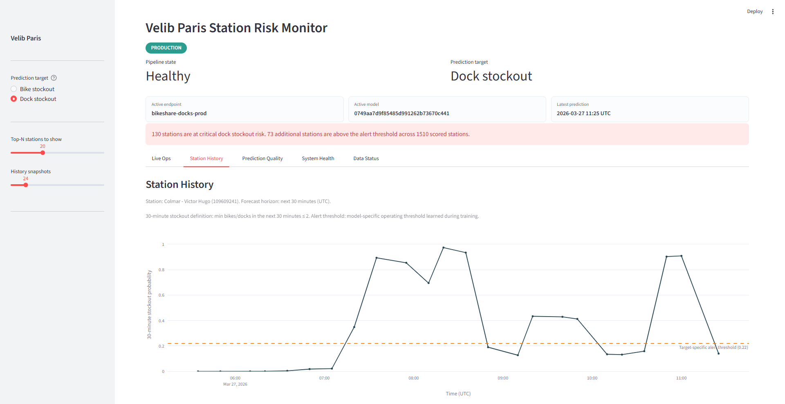

### Data Pipeline Status

Freshness checks for every data source against operator SLA windows.

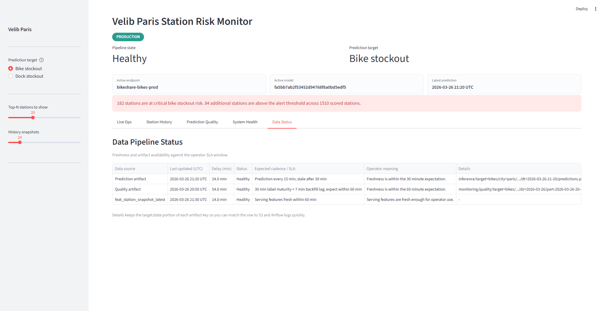
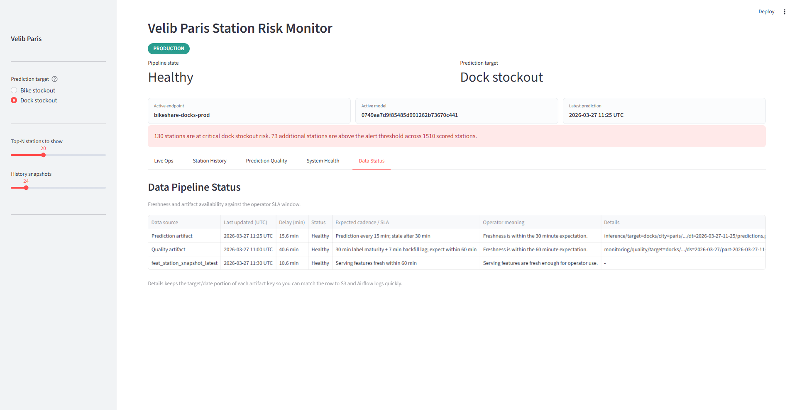
---

## Key Results

| Metric | Bikes Target | Docks Target |
|--------|-------------|-------------|
| PR-AUC (validation) | **0.961** | **0.960** |
| F-beta (beta=2.0) | 0.913 | 0.914 |
| Precision | 0.780 | 0.783 |
| Recall | 0.953 | 0.953 |
| Decision threshold | 0.20 | 0.22 |
| Training samples | 2,036,657 | 2,036,657 |
| Validation samples | 492,260 | 492,260 |
| Overfit gap | 0.008 | 0.003 |
| Features | 30 | 30 |
| Model | XGBoost | XGBoost |

> Full model cards: [Bikes](reports/2026-03-24-paris-bikes-xgb/model_card.md) | [Docks](reports/2026-03-24-paris-docks-xgb/model_card.md)

---

## Tech Stack

| Layer | Technology |
|-------|-----------|
| Data ingestion | Python 3.11, GBFS API (5-min), OpenWeather API 3.0 (1-hr) |
| Data warehouse | PostgreSQL 15, dbt 1.10 (star schema, 14 models, SCD2 dimensions) |
| Feature store | 30 features: temporal, inventory, rolling windows, neighbor graphs, weather |
| Orchestration | Apache Airflow 2.10.3, CeleryExecutor, Redis, tiered workers |
| ML training | XGBoost, scikit-learn, MLflow 3.10.1 |
| Model serving | AWS SageMaker (staging + production endpoints per target) |
| Request routing | AWS Lambda (target-aware, environment-aware) |
| Monitoring | CloudWatch custom metrics, SNS alerting, PSI drift detection |
| Dashboard | Streamlit (Folium maps, Plotly charts) |
| Infrastructure | Terraform 1.13.3 (S3, ECR, Lambda, IAM, CloudWatch alarms) |
| Containers | Docker Compose (Airflow, PostgreSQL, MLflow, Redis, Dashboard) |
| CI/CD | GitHub Actions (ruff, black, pytest, bandit, pip-audit, Terraform validate) |

---

## Data Pipeline

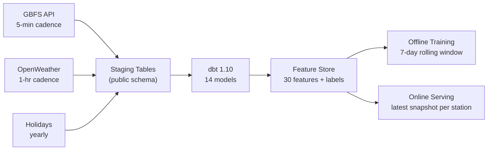

**30 engineered features** spanning six categories:

| Category | Examples |
|----------|---------|
| Temporal | hour, day-of-week, is_weekend, is_holiday |
| Inventory | utilization ratios, 5-min deltas, minutes since last snapshot |
| Rolling windows | 15/30/60-min net bike flow and mean inventory |
| Neighbor signals | distance-weighted bike/dock counts (K=5, 0.8 km radius) |
| Weather (current) | temperature, humidity, wind speed, precipitation, weather code |
| Weather (forecast) | hourly forecast temperature, precipitation, probability |

> Details: [docs/data_pipeline.md](docs/data_pipeline.md) | [Star schema ER diagram](docs/diagrams/star_schema.mmd)

---

## ML Lifecycle

1. **Train** — Temporal 80/20 split with 60-min anti-leakage gap. F-beta threshold optimization (beta=2, favoring recall over precision).
2. **Package** — Versioned model directory: `package_manifest.json` + MLflow pyfunc artifact + `eval_summary.json` + `model_card.md`.
3. **Deploy** — Export to S3, deploy to SageMaker staging endpoint, 24-hour observation gate with 6-point admission criteria.
4. **Monitor** — Quality backfill every 15 min (PR-AUC, F1 per 5-min bucket). PSI drift detection split into core features and weather features. CloudWatch alarms to SNS.
5. **Retrain** — Automated daily candidate training (3:30 AM UTC). New candidate must pass staging gate before production promotion.

> Details: [docs/ml_lifecycle.md](docs/ml_lifecycle.md)

---

## Operations

| Area | Target |
|------|--------|
| Prediction cadence | Every 15 minutes |
| Endpoint p95 latency | < 200 ms (warning), < 300 ms (critical) |
| PR-AUC (24h) | >= 0.70 |
| F1 (24h) | >= 0.55 |
| 5xx errors | 0 |
| PSI core drift | < 0.20 (warning), < 0.30 (critical) |
| Rollback | Single-command, per-target, via deployment state files |

**Dual-target isolation**: Bikes and docks each have independent SageMaker endpoints, S3 partitions, CloudWatch metric dimensions, deployment states, and dashboard views.

> Details: [docs/operations_runbook.md](docs/operations_runbook.md) | [docs/deployment_guide.md](docs/deployment_guide.md)

---

## Repository Layout

```
src/              Core Python: config, features, inference, ingest, monitoring, serving, training
pipelines/        CLI entrypoints: export, deploy, promote, rollback
app/              Streamlit dashboard (9 modules)
airflow/          13 Airflow DAGs (ingestion, feature build, quality, serving, retraining)
dbt/              dbt project: staging → intermediate → dims/facts → feature store
infra/terraform/  Bootstrap (remote backend) + Live (platform module)
docker/           Dockerfiles: Airflow, Lambda, Dashboard
test/             17 pytest modules covering contracts, gates, inference, monitoring
docs/             Architecture, data pipeline, ML lifecycle, deployment, operations, security
reports/          Model cards and evaluation artifacts
```

---

## Documentation

| Document | Purpose |
|----------|---------|
| [Architecture](docs/architecture.md) | System layout, Mermaid diagrams, target isolation |
| [Data Pipeline](docs/data_pipeline.md) | Data contract, warehouse model, feature store |
| [ML Lifecycle](docs/ml_lifecycle.md) | Training, evaluation, model packaging |
| [Deployment Guide](docs/deployment_guide.md) | Commands for local, EC2, Terraform, staging, production |
| [Operations Runbook](docs/operations_runbook.md) | SLA, monitoring, daily checks, incident response |
| [Dashboard](docs/dashboard.md) | Dashboard spec and target-aware behavior |
| [Security](docs/security.md) | Secrets, IAM, compliance |
| [CI/CD](docs/cicd.md) | Pipeline and packaging flow |

---

## Getting Started

See the full [README.md](README.md) for local setup, training examples, and runtime configuration.

## Demo Video

> [Watch the 3-minute walkthrough](#) *(link to be added after recording)*

See [docs/demo_video_script.md](docs/demo_video_script.md) for the recording script.
