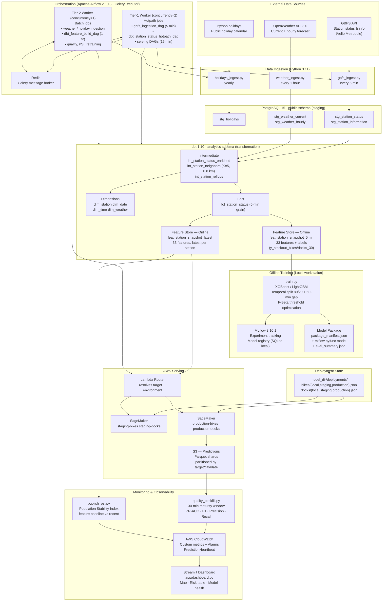
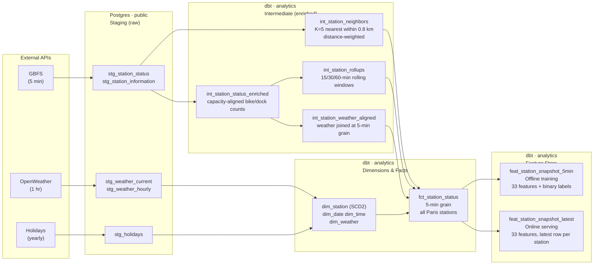
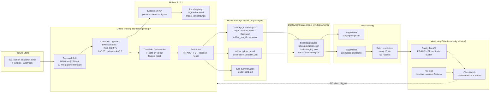
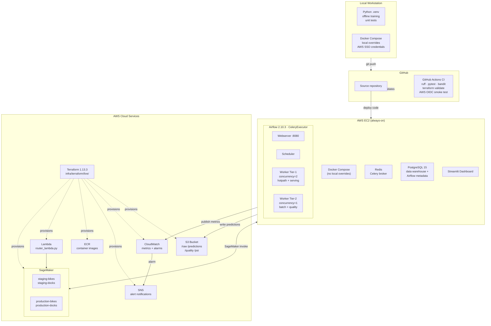

# System Architecture

## Overview
The platform is organized around three operating layers:
- data production: Python ingestion plus dbt models in Postgres
- model production: offline training, MLflow logging, and local model packages
- model activation: deployment-state files, staging/prod promotion, and rollback

The formal architecture is hybrid:
- local development for coding, tests, and offline model iteration
- EC2 for always-on data engineering and dashboard hosting
- AWS for serving, alerting, promotion, and rollback

## Component Inventory

| Component | Technology | Role |
|---|---|---|
| Data ingestion | Python 3.11 (`src/ingest/`) | API fetch → raw S3 + staging tables |
| Data warehouse | PostgreSQL 15 | `public.stg_*` staging, `analytics.*` curated |
| Transformation | dbt 1.10 | staging → intermediate → dims/facts → features |
| Orchestration | Apache Airflow 2.10.3 + CeleryExecutor | Scheduled DAGs (EC2-hosted) |
| Message broker | Redis | Celery task queue |
| Experiment tracking | MLflow 3.10.1 | Parameters, metrics, model registry |
| ML training | XGBoost, LightGBM, scikit-learn | Offline training (`src/training/train.py`) |
| Model packaging | `src/model_package/` | Package manifests + deployment state JSON |
| Serving | AWS SageMaker + Lambda | Staging/prod endpoints per target |
| Object storage | AWS S3 | Raw, predictions, quality, PSI, packages |
| Monitoring | CloudWatch + SNS | Custom metrics, alarms, notifications |
| Dashboard | Streamlit (`app/dashboard/`) | Station risk map, model health, freshness |
| Container registry | AWS ECR | Inference container images |
| Infrastructure | Terraform 1.13.3 | `infra/terraform/bootstrap/` + `live/` |
| CI/CD | GitHub Actions | Tests, linting, Terraform validation |

## Architecture Diagrams

### Diagram 1 — System Architecture Overview



### Diagram 2 — Data Pipeline Flow



**33 feature columns per snapshot:**

| Category | Features |
|---|---|
| Temporal | `hour`, `dow`, `is_weekend`, `is_holiday` |
| Inventory | `util_bikes`, `util_docks`, `capacity`, `delta_bikes_5m`, `delta_docks_5m`, `minutes_since_prev_snapshot` |
| Rolling windows | `roll15/30/60_net_bikes`, `roll15/30/60_bikes_mean` |
| Neighbor signals | `nbr_bikes_weighted`, `nbr_docks_weighted`, `neighbor_count_within_radius` |
| Weather — current | `temp`, `humidity`, `wind`, `precip`, `weather_code` |
| Weather — forecast | `hourly_temp`, `hourly_humidity`, `hourly_wind`, `hourly_precip`, `hourly_weather_code`, `hourly_precip_prob` |

### Diagram 3 — ML Lifecycle



### Diagram 4 — Infrastructure & Deployment Topology



## Data Flow
1. Python ingestion writes raw payloads and `public.stg_*`.
2. dbt builds curated and feature tables in `analytics.*`.
3. Offline training reads `analytics.feat_station_snapshot_5min`.
4. Online and batch inference read `analytics.feat_station_snapshot_latest`.
5. Training emits a package directory under `model_dir/packages/<target>/...`.
6. Activation writes a deployment-state record under `model_dir/deployments/<target>/<environment>.json`.

## Targets And Isolation
The platform supports two prediction targets on a shared code path:
- `bikes`
- `docks`

The following resources must remain target-specific:
- package roots
- deployment state
- S3 inference and monitoring partitions
- CloudWatch metric dimensions
- SageMaker endpoint names
- dashboard labels and queries

## Model Package
Each model package has this fixed structure:

```text
<package_dir>/
  package_manifest.json
  model/
  artifacts/
```

`package_manifest.json` is the static source of truth for:
- target definition
- threshold
- feature contract version
- feature order
- model identity
- registry metadata

## Deployment State
Deployment-state JSON is the dynamic source of truth for:
- active environment
- active package directory
- active registered model/version
- last activation timestamp
- active endpoint name when deployed

The formal layout is:

```text
model_dir/deployments/bikes/local.json
model_dir/deployments/bikes/staging.json
model_dir/deployments/bikes/production.json
model_dir/deployments/docks/local.json
model_dir/deployments/docks/staging.json
model_dir/deployments/docks/production.json
```

Single-file deployment state is legacy-only and must not be used for formal dual-target workflows.

## Runtime Contract
Formal runtime settings:
- Postgres: `PGHOST`, `PGPORT`, `PGDATABASE`, `PGUSER`, `PGPASSWORD`
- Scope: `CITY`, `BUCKET`, `TARGET_NAME`, `SERVING_ENVIRONMENT`
- Deployment: `DEPLOYMENT_STATE_PATH`, `MODEL_PACKAGE_DIR`
- MLflow local default: `MLFLOW_TRACKING_URI=sqlite:///model_dir/mlflow.db`

## Operating Split
Local workstation:
- code changes
- unit and integration tests
- offline training and model debug

EC2:
- Docker Compose
- Airflow scheduler/webserver
- Postgres
- dbt jobs
- serving DAGs for prediction, quality backfill, metrics publish, and PSI publish
- dashboard service

AWS:
- ECR
- S3
- IAM
- SageMaker staging/prod endpoints
- CloudWatch alarms and dashboards
- SNS notifications
- router lambda
- promote and rollback scripts
